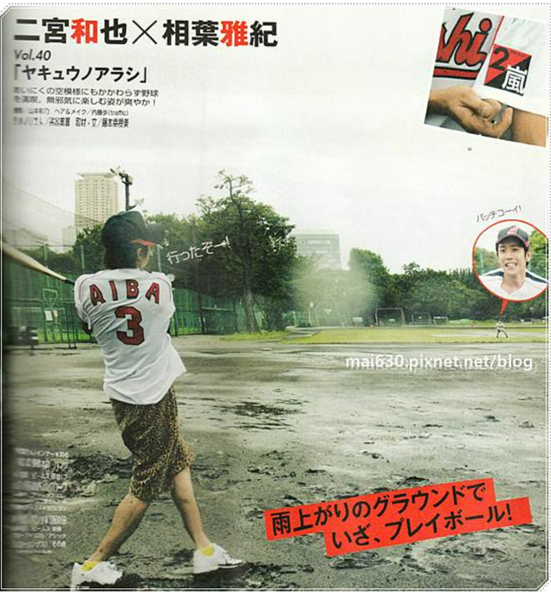
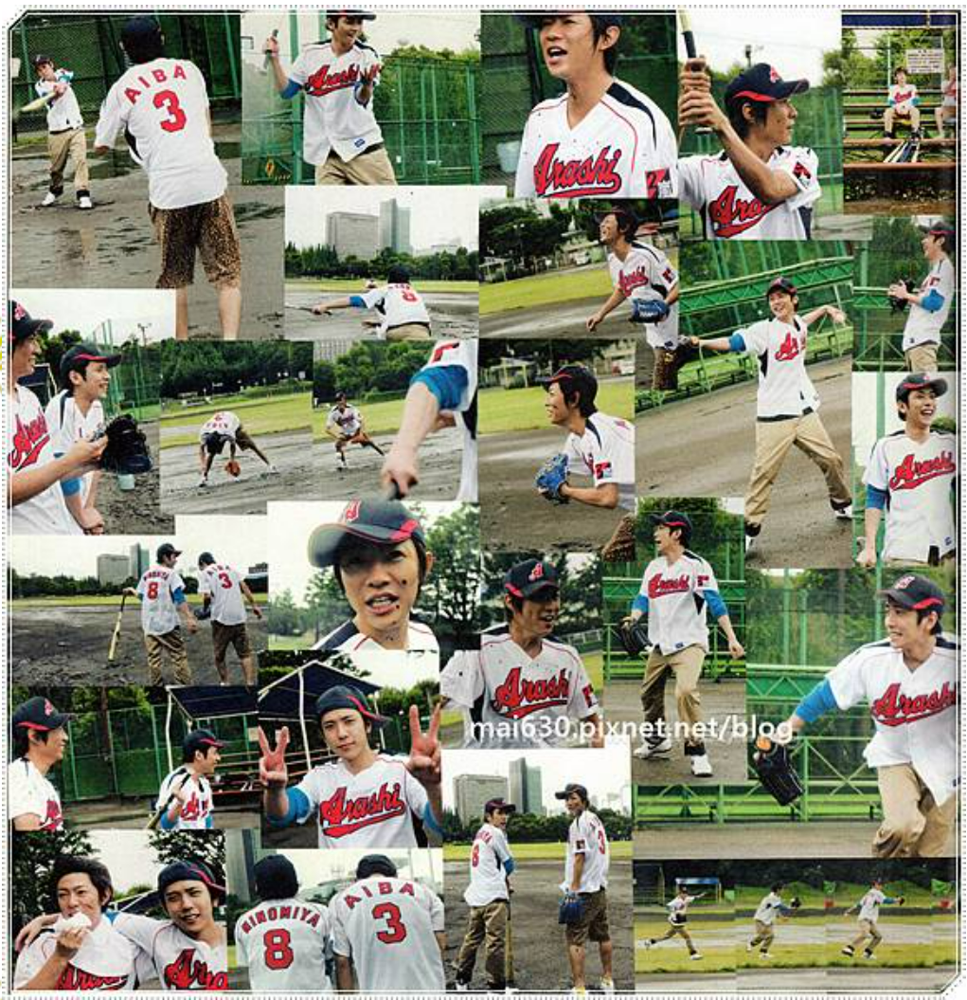

【山組/天然/模特】深寂-Lone Walk in the Depths-01

大野智蜷縮在自己房間的一隅，外頭客廳中傳來父母尖銳的爭吵聲，那激烈的對峙如同刀刃般劃過他的心靈，讓他感到窒息。他一直無法習慣父母間的這種爭執，那些聲音在他心中回盪，仿佛每一句話都是對他的責難。

坐在書桌前，大野試圖專注於學習，但他的心思根本無法進入課業，字句在他眼前模糊不清。那些爭吵聲彷彿將他的心思一次次拉回那個混亂的現實。手中緊握著筆，無法寫下數學公式，而是化為一團團糾結的線條。

他的目光不自覺地落在牆上那幅全家福的畫，那是他小學時期的作品，生動捕捉了一家三口郊遊時的溫馨快樂。當時的他，滿懷歡喜，將那幸福的時刻定格在畫布上。父母當時對這幅畫讚賞有加，那是他們對他繪畫天賦的認可，也是他對繪畫產生興趣的開始。

等他升上中學以後，父母希望他專注於學業，不應把重心放在繪畫上。但是大野依然會偷偷拿起畫筆，用色彩和線條表達他的情感。

然而，大野升高中的考試沒有考好，父母間的爭吵也日益增多，他常常覺得是自己的錯。

「又是為了我的成績吵架吧？」大野喃喃自語，他的聲音中充滿了自責。

突然間，一聲門的撞擊聲讓大野從回憶中驚醒。他聽到父親怒氣沖沖地離開，隨後是母親的啜泣聲。房間變得安靜，大野感覺到一種壓抑的孤獨，他不敢出房門,只能默默地等待家中的風暴過去。

父親又一次離家出走，家中只剩下母親的哭泣聲。大野不敢走出房間，只能蜷縮在自己的世界裡，默默等待這一切過去。

他想，這次母親要等多久，父親才會回來。

※

在高中的第一個學期，大野放下畫筆，將所有時間都投入到學業中，希望這能改善家裡的氣氛。

終於，大野在期末考試拿到了不錯的成績，他期待這能讓家裡的氣氛好轉。回家時，意外地發現父親在家，雖然父母的臉色依然緊張，但至少他們沒有在爭吵。

那晚，父母竟然冷靜交談，這在大野的記憶中極為罕見。大野心中滋生出一絲希望，也許一切都會好轉。飯後，他拿出成績單，期待父親的稱讚。

「爸，看，我這次考得不錯吧？」大野試著引起父親的注意。

「嗯，不錯。」父親只是隨意地瞥了一眼，語氣顯得毫不在意。

大野滿是失落。

※

大野第二天醒來，家中空無一人。他在家中靜靜地等待，直到下午母親才獨自一人回家。她看起來疲憊，但眼神中透露出解脫。

「我和你爸爸已經辦完離婚手續了，你得跟我一起走。」母親平靜地說。

「離婚？你們就這樣結束了？」大野驚問，「我們要去哪裡，媽媽？」

「我們要回我的故鄉，遠離這一切的地方。」母親說。

「但我不想離開東京，這裡有我的學校，我的朋友，我的......」大野未能說出「家」這一字。

他的家庭或許已經破碎，但這個城市裝載著他從小到大的無數記憶：學校走廊的熙熙攘攘，朋友們的歡聲笑語，這些平凡而深刻的日常讓他無法割捨。他的聲音低落，似乎藏著對未知未來的畏懼，以及對現在生活的深切眷戀。

所以當母親告訴他們要離開東京，他們必須離開這個熟悉的城市，前往一個陌生的小島時，大野最初的反應是反抗。

在與母親爭吵中，他才知道，他的父親大野守，已經有了新的伴侶，決定與母親佳子離婚，把他們趕出家門。

「你父親曾經對我說過他會永遠愛我，不在乎我的背景。但現在，他找到了一位社會地位相符的女人，不再需要我了。我只有你了，跟我走吧。如果你留下，父親也不會好好照顧你，可能會把你交給給那個女人照顧，這我無法接受。」母親哭著說。

大野看到母親那嬌小而脆弱的模樣，他心碎了，父親已不再愛他們了，他屈服了。

大野走回到房間，開始整理行李。牆上那幅他手繪的全家福，線條簡單、色彩鮮明，彷彿是童心未泯的梦境。

當初，他用稚嫩的筆法畫下和樂融融的一家三口，那時候父母感情和睦。現在，隨著父母婚姻的破裂，這幅畫成成為了時光的容器，裝載著那段美好的回憶。

比對如今的家庭破碎，他的心情沉重，對逝去的幸福無比懷念。

[圖片說明]：

大野智為2019年的24時間TV，所設計的慈善T恤。 

在「嵐にしやがれ」上，大野智是這麼說的。圖案設計的是人與人之間緊密相連的手，象徵著一起邁向新時代的概念。表達了人生中各種情緒——哭泣、呼喊，以及生活中的其他豐富情感和場景。然而，即使經歷這些，人們還是能夠相互支持，一起走向新的時代。

有種被好好保護、給予溫暖的感覺，如夢境般的奇幻人物，最後一起開出了美麗的花朵。

※

因為母親佳子決定離開父親，大野的生活轉折點來臨了。原本在東京就讀高中一年級的他，面臨著人生中的一次重大轉變——轉學並跟隨母親回到她的故鄉，位於瀨戶內海的小豆島。

他們的旅程從東京出發，乘坐新幹線南下至岡山，然後轉乘巴士。當他們在港口下車時，數十隻海鷗從售票小屋的屋頂飛舞而下，數十隻海鷗從售票小屋的屋頂翱翔而下，撲面而來。大野被驚得縮在母親身後，但母親卻勇敢地抬頭直視，瞪著那些海鷗。

海鷗在空中盤旋數圈後，停落在渡輪的欄杆上。天空灰沉沉的，似乎預示著未來的不確定。

他們買票登船，大野坐在椅子上，默默地觀察著母親。她的臉上寫滿了憂愁，手上緊抓著行李，青筋暴露。

鳴笛聲響起，渡輪開始啟航，原本停在港口的海鷗們紛紛飛起，追趕著渡輪。大野走出二樓的座艙，踩上鐵製樓梯，來到船頂的展望台。看著海鷗們伴隨著渡輪飛舞，有幾隻停在甲板上，單眼盯著大野，仿佛是在監視他。當他靠近時，它們又飛走，彷彿在保持著一種神秘的距離。

渡輪駛離岸邊，海鷗漸漸消失在視野之外。天空佈滿灰白色的雲層，海面出奇地平靜，只有渡輪劃過時留下的漣漪在四周輕輕擴散。海水的顏色比天空更加暗沉，呈現出一種深邃的灰黑色，似乎沒有盡頭。

大野站在渡輪的甲板上，眺望著逐漸遠離的陸地，心中泛起迷茫與不安的漣漪。如今，他對於父親的期盼已然破碎，自己和母親被遺棄了。未來，他要在小豆島活。這是個充滿未知的海島，與他所熟知的城市迥異。

從東京遙遙奔赴於此的途中，他看見了周遭景觀的變遷：房屋愈發低矮，街道愈發狹窄，行人愈發稀少，自己彷彿被放逐至一個陌生的世界。

儘管母親不斷保證島上的美好，他卻覺得那是安撫之詞。他心中充滿了疑問：自己能否適應新生活？若父親的情人左右父親，他會不會永遠困於這座小島？

陸地逐漸在視野中模糊消逝。他的過往、他的回憶，現在都已遙不可及。

[圖片說明]：

這是去小豆島取材時，搭渡輪所拍到的照片。從港口到啟程，超多海鷗盤桓飛舞。我爬到渡輪的最上層的甲板，海鷗也是無處不在，站在圍欄上盯著人看。

直到渡輪駛離岸邊很遠了，海鷗才漸漸離去

這些過去的點點滴滴，建築起他們之間無可取代的深厚情誼。

然而，大野的出現打破了這一切，使得那些互相陪伴的時光變得支離破碎。

[圖片說明：]

煤爐購物 棒球少年  

non-no 2010年 11月 二宮和也 三浦春馬 チャンミン トートなし
blog網址 

※

開學第一天早上，相葉發現自己遺漏了幾道數學習題，急忙向二宮求助。

「喂，和也，借我抄一下！」相葉希望能在老師抵達前迅速抄下數學習題。

「算了吧，你自己想辦法。」二宮擺出一副不樂意的樣子，他還記著前幾天的不愉快，假裝作不肯借，想讓相葉感受到自己的重要性。

在二宮和相葉互相開玩笑，爭搶著作業本的打鬧中，教室的門忽然開啟，老師帶著一名新面孔走了進來。

老師向全班介紹說，大野是一位從東京而來的轉學生，並且請他進行自我介紹。

「大家好，我是大野智，請多多指教。」大野的話簡短，但他的聲音清晰，隨後，他就沉默了。

他那不多言的舉止，使得教室短暫的空氣凝固了下來，降臨了一片出乎意料的安靜。為了打破這突如其來的靜默，相葉便迅速熱情地開口。

「大野同學是很聰明，而且釣魚技術也超一流，暑假的時候他還幫了我很多忙。」相葉興奮地補充道。

「你們認識？」老師略顯驚訝地詢問。

「是的，我們暑假一起玩耍。」相葉回答，看起來相當得意。

「那麼，就讓大野同學坐在相葉旁邊，這樣你可以幫助他更好地融入學校生活。」老師宣佈後說道：「二宮同學，麻煩你把座位換到門口那邊，謝謝你。」

這個安排明顯是希望讓新生能快速適應新環境，但對一直坐在那個位置的二宮來說，無疑是個不小的變化。看著相葉興奮的樣子，二宮心裡雖然感到一股不快，但他還是咬牙壓抑住自己的情緒，默默地將自己的東西搬到了新的座位。

一到下課，大野立刻成為了女孩們熱切關注的中心。她們簇擁在他周圍，對他那來自東京的背景展開了無窮的好奇和詢問。雖然大野依然保持著其一貫的冷漠，相葉卻忍不住熱情地替他解答這些問題。

這樣的場面讓二宮甚是無奈，不禁暗自嘀咕：「這個傻瓜。」

※

放學的鐘聲響起，二宮在教室門口站定，等待著與相葉一同踏上回家的路。然而，相葉似乎對周遭毫無覺察，依然與坐在旁邊的大野交談不斷。這種情況令二宮感到不耐煩，他踱步來到兩人身邊，卻發現他們正鑽研著數學問題。

相葉在大野的幫助下解開了自己的疑惑，對此感到無比欣慰和開心。

「哇！大野真的很厲害。」相葉讚歎著。

這話聽在二宮耳中，更加刺激了他。在他眼裡，大野僅對作業稍作指點，相葉就這麼感激，可明明作業大部分都是抄自己的，為何不也來誇獎自己呢？

「這種簡單的題目都不會，才會覺得厲害啊？」二宮帶著些許譏諷插嘴。

「哎呀，我就是比較笨嘛，數學太難了！」相葉轉向二宮，「你知道嗎？大野講起來真的很容易理解，他一講我就懂了。」

「不過我覺得他總是一副想睡的樣子，上課也不聽老師講課，只會看著窗外發呆。」二宮說。

「可是老師叫他起來回答問題，他都答得出來呢。」

「他大概是覺得鄉下教的課太簡單，不屑聽吧。」

「他一定是在沈思，在想更深入的問題。」

「我們能不能不談大野了？我們一起回家吧。」

「不行，我今天得送大野回家。他對這裡還不熟，需要我陪著。」

「怎麼就拋下我了？」二宮瞪大了眼睛。

「真不好意思，但是初來乍到，他還需要我幫忙指路。」

「明明我家就在你家旁邊，為什麼不能跟我一起走？」二宮忿忿不平地質問道。不僅在學校連座位都被搶，連一同回家的路途都被攔截。

「等大野熟悉環境後，我們再一起回家，好嗎？」

相葉說完，就拉著大野走出教室。

「你整個暑假都帶他在島上跑來跑去的，他還會不熟悉路況？」二宮獨自一人站在教室門口，有些氣憤地哼了一聲。

教室內還有一些同學仍未離開，二宮找到了棒球社的隊友——橫山和風間，開始吐槽起相葉對大野的過度保護。當他們想起大野在暑假棒球賽中的表現時，不禁也開始表達出自己的不滿。他們的聲音吸引了其它男同學的注意，這些男同學同樣因為大野在女生中的廣受歡迎以及他那冷漠的態度而感到一絲嫉妒。

於是，這群學生決定要對大野進行一些「教育」，讓他明白在這座小島上，他不能夠肆無忌憚地忽略一切。

[圖片說明：高中教室]

※

對大野而言，父母的離異帶來了深刻的陰影，令他無法在心靈上打開，與人建立聯繫。他渴望的，只是返回那個充滿回憶的東京，回到那個安慰自己的舊世界中。

抱著這樣的心境，他不自覺地戴上了一副無形的面具。這副無形的面具，既是防線，也是牢籠，將大野囚禁在一個看似平靜實則幽暗的房間中，只有自己能觸碰到自己內心中最真實又脆弱的部分。他渴望融入，卻更害怕世界對他內心世界的窺視，害怕那些關心與善意的目光最終會撕裂他勉強維持的鎧甲。

但這種內心的孤立，卻在無意中散發出了一絲與周遭環境脫節的氣息，被同學們誤解為一種蔑視。在他們眼中，大野不過是個瞧不起這片土地與人們的都市來客。於是，校園裡的玩笑逐漸升級為對他的刻意排擠，這種隱晦的敵意如陰影般籠罩著大野，卻未能觸及到他心底最真實的孤獨。

學校生活中，多次場合下的小動作、悄聲譏笑以及蓄意的無視，通通在面對大野時演變成一種刻意的群體霸淩。面對這一切，大野沉默始終如一，他只能用更加淡漠的態度來保護自己。

這些暗中的欺淩如同冷冽的寒風，不斷刺穿大野那薄弱的盾牌，嘲諷著他與眾不同的行徑。每一次故意排擠，每一聲未被察覺的冷嘲，都讓他的心進一步沈入孤單的深淵。

大野的心靈似乎在每一段低語與每一次漠視中更加僵硬，他的冷漠成了最堅硬的護甲，將自己封鎖於一個人際關係無法侵入的堅固堡壘中。他將自己的感受深藏，以避免那些傷口被新的嘲諷觸碰，以避免內心的疼痛被放大於眾人面前。

起初，相葉並未意識到這種情況，他以認為大家都和他一樣，樂於接納一個新同學。

直到一次意外發生，他才察覺到情況不對。

※

在那朵濃雲壓頂的午後，全班同學正於體育館內投身運動時，幾位同學不由分說地指派大野去搬運體育器材。當他們穿越陰暗的樓梯，來到地下室的儲物間前，大野使先邁入了這個房間，背後馬上傳來閂鎖之聲。他本能地回頭一望，門已關閉，獨留他一人陷入困境。

四周為混凝土的牆壁，頂上一簇昏黃的燈光，空氣中瀰漫灰塵與黴味。大野試圖用儲物室裡的老舊籃球、鈍重的啞鈴，甚至是軟弱的跳繩來撞擊那扇堅固的門，但是沒有用，無力感壟罩著他，癱坐在冰冷的地板上，只有天花板上隱約透入微弱聲響。

隔節課程開始時，相葉隨即察覺到大野那異常的缺席。起初以為或許大野因不適前往保健室，他前往尋找，卻未見人影。相葉心急如焚，穿行於校園的每一處角落，尋覓著對方的蹤跡。巧合的是，在學生私語與隱隱哄笑中，他聽到大野正被遺忘於地下室的深處。

他急忙奔向體育館，衝到地下室的儲物間，面對那扇被木板卡住的門，他幾乎不敢相信這是同學們的惡作劇。他全身力量集中於肩膀，一次次撞擊，直至木板終於松動，門隙被擠開一條縫隙。

「大野！」相葉的呼喚中帶著驚慌，他搬開阻隔的木板，推開沉重的門。

當門緩緩開啟，見到大野靜默垂坐於角落，他的手臂交叉於胸前，彷彿在尋求一絲自我保護。從他的手指尖端傳出的是輕微而不安的顫抖。

相葉的心狠狠一縮，他對於同儕的惡劣行徑以及自己的疏忽大意滿是懊悔與自責。他加快腳步，來到大野的身旁輕輕蹲下身子，嘗試與他的視線對視。

「對不起，我來晚了。你沒事吧？」相葉伸出手，想扶起大野。

「都是因為你總是繞著我轉，我才會成為霸淩的目標。」大野突然起身，含怒目視相葉。

「我沒有想讓你受欺負，我只是想讓你不那麼孤單。」相葉感到錯愕但仍試圖解釋。

「你以為你在幫我？其實只是讓我更尷尬。你那些所謂的朋友會討厭我，因為在他們眼中，我搶走了你。」

「那是他們誤會了，不是你的錯。」

「所以你覺得，我遭受到欺淩，你輕描淡寫一句『誤會』便足以為他們開脫？」大野的保護屏障在壓力下碎裂，情緒宣洩如同洩洪的洪水，夾帶著種種辛酸和不甘。

「對不起，我說錯話了，我只是想關心你。」

「正是你這份關懷，將我推到了所有人的對立面。」

「我只是不願見你孤單一人。」相葉的淚水在眼眶中打著轉，他的關心不慎成為了大野的負累。

「夠了，我不需要你的同情或陪伴，即便獨自面對一切，我也能夠生活下去。」

大野大步從相葉身旁走過，離開了儲物間。

相葉想要叫停大野，想繼續解釋，但他並未張嘴，因為他深知，此時此刻，無論他說何種話語，只會讓對方更加生氣。他的內心中充滿了無力和自責。

曾經，相葉以為自己能成為大野寂寞天空中的溫暖陽光，卻沒想到終究可能變成了帶來陰霾的風。
