【山組/天然/模特】深寂-Lone Walk in the Depths-01

**大野智**蜷縮在自己房間的一隅，外頭客廳中傳來父母尖銳的爭吵聲，那激烈的對峙如同刀刃般劃過他的心靈，讓他感到窒息。他一直無法習慣父母間的這種爭執，那些聲音在他心中回盪，*仿佛每一句話都是對他的責難*。

坐在書桌前，大野試圖專注於學習，但他的心思根本無法進入課業，字句在他眼前模糊不清。那些爭吵聲彷彿將他的心思一次次拉回那個混亂的現實。手中緊握著筆，無法寫下，而是化為一團團糾結的線條。

他的目光不自覺地落在牆上那幅全家福的畫，那是他小學時期的作品，生動捕捉了一家三口郊遊時的溫馨快樂。當時的他，滿懷歡喜，將那幸福的時刻定格在畫布上。父母當時對這幅畫讚賞有加，那是他們對他繪畫天賦的認可，也是他對繪畫產生興趣的開始。

等他升上中學以後，父母希望他專注於學業，不應把重心放在繪畫上。但是大野依然會偷偷拿起畫筆，用色彩和線條表達他的情感。

然而，大野升高中的考試沒有考好，父母間的爭吵也日益增多，他常常覺得是自己的錯。

「又是為了我的成績吵架吧？」大野喃喃自語，他的聲音中充滿了自責。

突然間，一聲門的撞擊聲讓大野從回憶中驚醒。他聽到父親怒氣沖沖地離開，隨後是母親的啜泣聲。房間變得安靜，大野感覺到一種壓抑的孤獨，他不敢出房門，只能默默地等待家中的風暴過去。

父親又一次離家出走，家中只剩下母親的哭泣聲。大野不敢走出房間，只能蜷縮在自己的世界裡，默默等待這一切過去。

他想，這次母親要等多久，父親才會回來。

※

在高中的第一個學期，大野放下畫筆，將所有時間都投入到學業中，希望這能改善家裡的氣氛。

終於，大野在期末考試拿到了不錯的成績，他期待這能讓家裡的氣氛好轉。回家時，意外地發現父親在家，雖然父母的臉色依然緊張，但至少他們沒有在爭吵。

那晚，父母竟然冷靜交談，這在大野的記憶中極為罕見。大野心中滋生出一絲希望，也許一切都會好轉。飯後，他拿出成績單，期待父親的稱讚。

「爸，看，我這次考得不錯吧？」大野試著引起父親的注意。

「嗯，不錯。」父親只是隨意地瞥了一眼，語氣顯得毫不在意。

大野滿是失落。

※

大野第二天醒來，家中空無一人。他在家中靜靜地等待，直到下午母親才獨自一人回家。她看起來疲憊，但眼神中透露出解脫。

「我和你爸爸已經辦完離婚手續了，你得跟我一起走。」母親平靜地說。

「離婚？你們就這樣結束了？」大野驚問，「我們要去哪裡，媽媽？」

「我們要回我的故鄉，遠離這一切的地方。」母親說。

「但我不想離開東京，這裡有我的學校，我的朋友，我的......」大野未能說出「家」這一字。

他的家庭或許已經破碎，但這個城市裝載著他從小到大的無數記憶：學校走廊的熙熙攘攘，朋友們的歡聲笑語，這些平凡而深刻的日常讓他無法割捨。他的聲音低落，似乎藏著對未知未來的畏懼，以及對現在生活的深切眷戀。

所以當母親告訴他們要離開東京，他們必須離開這個熟悉的城市，前往一個陌生的小島時，大野最初的反應是反抗。

在與母親爭吵中，他才知道，他的父親大野守，已經有了新的伴侶，決定與母親佳子離婚，把他們趕出家門。

「你父親曾經對我說過他會永遠愛我，不在乎我的背景。但現在，他找到了一位社會地位相符的女人，不再需要我了。我只有你了，跟我走吧。如果你留下，父親也不會好好照顧你，可能會把你交給給那個女人照顧，這我無法接受。」母親哭著說。

大野看到母親那嬌小而脆弱的模樣，他心碎了，父親已不再愛他們了，他屈服了。

大野走回到房間，開始整理行李。牆上那幅他手繪的全家福，線條簡單、色彩鮮明，彷佛是童心未泯的梦境。

當初，他用稚嫩的筆法畫下和樂融融的一家三口，那時候父母感情和睦。現在，隨著父母婚姻的破裂，這幅畫成成為了時光的容器，裝載著那段美好的回憶。

比對如今的家庭破碎，他的心情沉重，對逝去的幸福無比懷念。

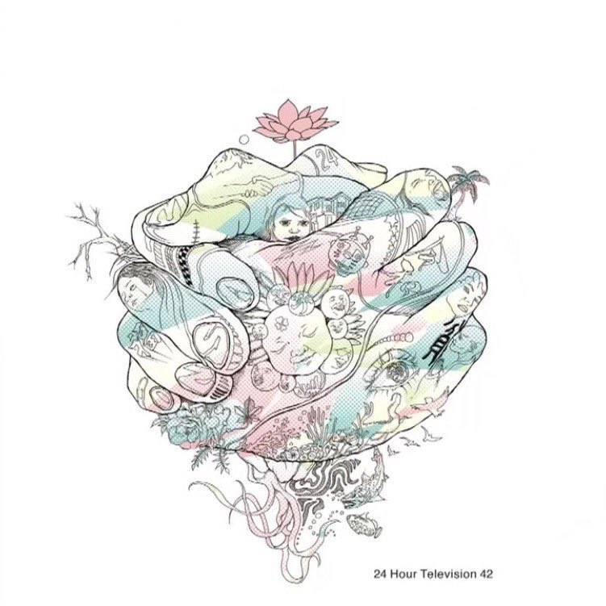

[圖片說明]：

這是大野智為2019年的24時間TV，所設計的慈善T恤。

在「嵐にしやがれ」上，大野智是這麼說的。圖案設計的是人與人之間緊密相連的手，象徵著一起邁向新時代的概念。表達了人生中各種情緒——哭泣、呼喊，以及生活中的其他豐富情感和場景。然而，即使經歷這些，人們還是能夠相互支持，一起走向新的時代。
有種被好好保護、給予溫暖的感覺，如夢境般的奇幻人物，最後一起開出了美麗的花朵。

※

因為母親佳子決定離開父親，大野的生活轉折點來臨了。原本在東京就讀高中一年級的他，面臨著人生中的一次重大轉變——轉學並跟隨母親回到她的故鄉，位於瀨戶內海的小豆島。

他們的旅程從東京出發，乘坐新幹線南下至岡山，然後轉乘巴士。當他們在港口下車時，數十隻海鷗從售票小屋的屋頂飛舞而下，數十隻海鷗從售票小屋的屋頂翱翔而下，撲面而來。大野被驚得縮在母親身後，但母親卻勇敢地抬頭直視，瞪著那些海鷗。

海鷗在空中盤旋數圈後，停落在渡輪的欄杆上。天空灰沉沉的，似乎預示著未來的不確定。

他們買票登船，大野坐在椅子上，默默地觀察著母親。她的臉上寫滿了憂愁，手上緊抓著行李，青筋暴露。

鳴笛聲響起，渡輪開始啟航，原本停在港口的海鷗們紛紛飛起，追趕著渡輪。大野走出二樓的座艙，踩上鐵製樓梯，來到船頂的展望台。看著海鷗們伴隨著渡輪飛舞，有幾隻停在甲板上，單眼盯著大野，仿佛是在監視他。當他靠近時，它們又飛走，彷彿在保持著一種神秘的距離。

渡輪駛離岸邊，海鷗漸漸消失在視野之外。天空佈滿灰白色的雲層，海面出奇地平靜，只有渡輪劃過時留下的漣漪在四周輕輕擴散。海水的顏色比天空更加暗沉，呈現出一種深邃的灰黑色，似乎沒有盡頭。

大野站在渡輪的甲板上，眺望著逐漸遠離的陸地，心中泛起迷茫與不安的漣漪。如今，他對於父親的期盼已然破碎，自己和母親被遺棄了。未來，他要在小豆島活。這是個充滿未知的海島，與他所熟知的城市迥異。

從東京遙遙奔赴於此的途中，他看見了周遭景觀的變遷：房屋愈發低矮，街道愈發狹窄，行人愈發稀少，自己彷彿被放逐至一個陌生的世界。

儘管母親不斷保證島上的美好，他卻覺得那是安撫之詞。他心中充滿了疑問：自己能否適應新生活？若父親的情人左右父親，他會不會永遠困於這座小島？

陸地逐漸在視野中模糊消逝。他的過往、他的回憶，現在都已遙不可及。

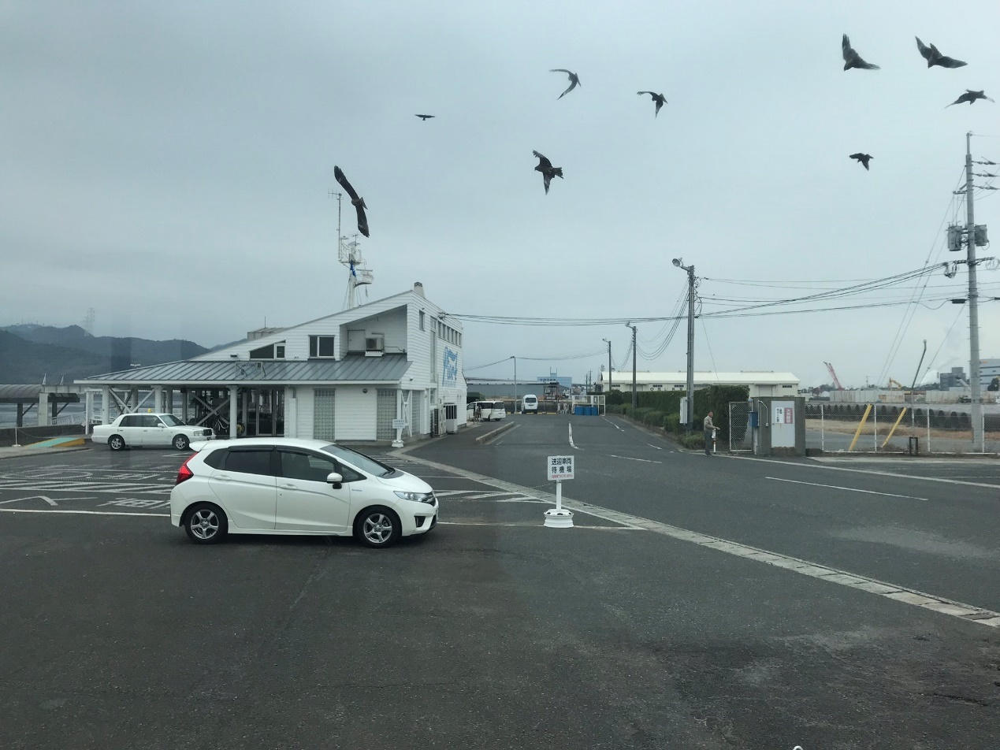

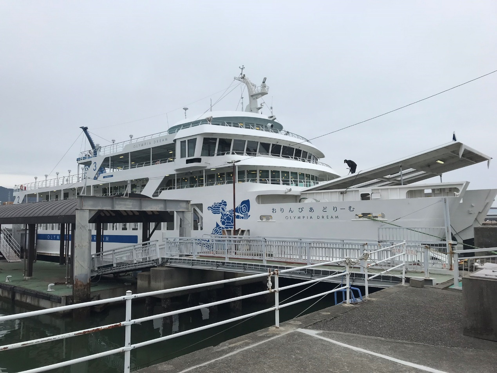

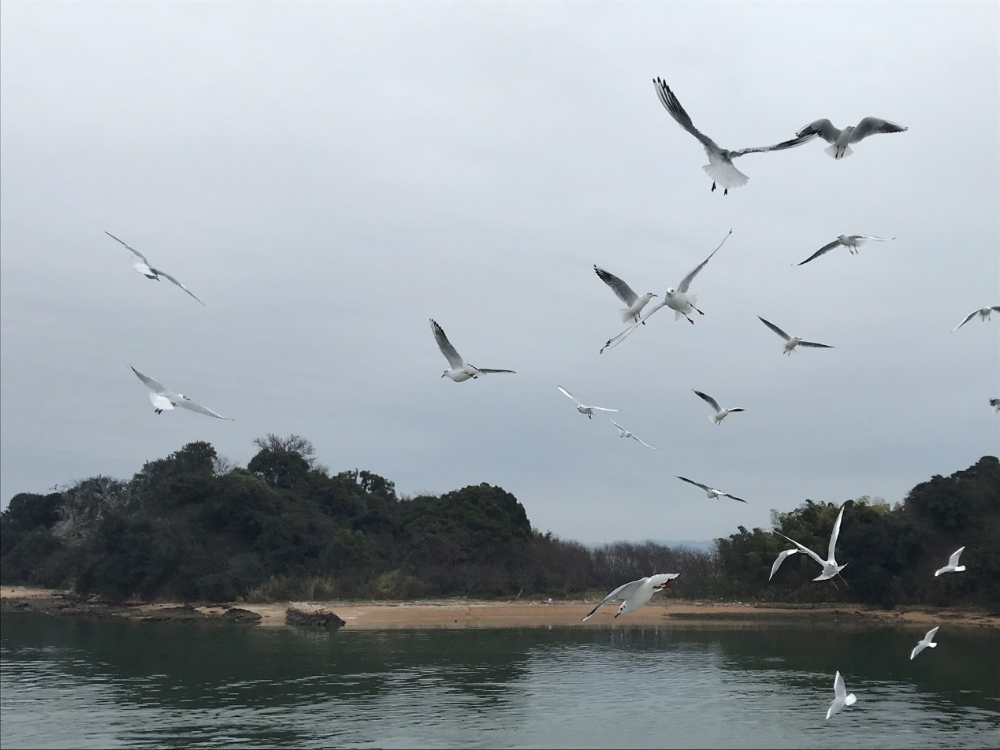

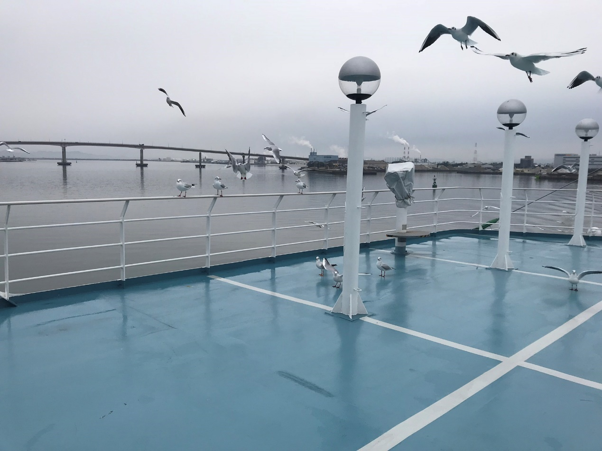

[圖片說明]：

這是去小豆島取材時，搭渡輪所拍到的照片。從港口到啟程，超多海鷗盤桓飛舞。我爬到渡輪的最上層的甲板，海鷗也是無處不在，站在圍欄上盯著人看。

直到渡輪駛離岸邊很遠了，海鷗才漸漸離去

※

小豆島，一個散發著古老韻味和故事的地方，座落於瀨戶內海中。這片土地不僅是該地區最大的島嶼之一，還擁有著豐富的歷史和文化。古時，它曾是繁華的海港，戰略地理位置重要，這裡的巨岩質地精良，曾為大阪城建築的基石。

如今以其豐富的橄欖栽培歷史聞名於世。這裡的氣候宜人，與地中海氣候相似，成為了橄欖樹茂盛生長的絕佳環境。小豆島上不僅橄欖豐收，還有其他豐富的特產，如醬油和素麵，被合稱為「小豆島三寶」。

這座島嶼上的寒霞溪，以其秀麗的自然風光聞名於世，從島嶼的最高峰星城山穿過美原高原，長年侵蝕而成的集塊岩，山坡上森林茂密，夏季綠意盎然，秋季滿山楓紅因溪穀，被譽為「日本三大溪谷美景」之一。

流淌在小豆島本島與前島之間，是世界最窄的土渕海峽，隨著潮汐變化，會顯露出最受戀人們青睞的「天使之路」。這裡的二十四之瞳電影村、小豆島橄欖公園等景點，每年吸引著無數遊客前來遊覽。

而對於當地年輕人的教育而言，香川縣立小豆島高等學校扮演著重要的角色。這所學校坐落於草壁本町，是一所提供全日制普通科課程的縣立高中，通稱「小高」。學校豐富的校園生活和多元的社團活動，包括運動部和文化部，為學生提供了展示才能的舞臺和培養興趣的機會。

對於那些來自周邊小島的學生，學校提供了宿舍設施，使他們能夠方便地在小豆島接受教育。高中的宿舍不僅提供基本生活需求，還鼓勵學生參與宿舍的日常管理和維護工作，培養他們的獨立和責任感。

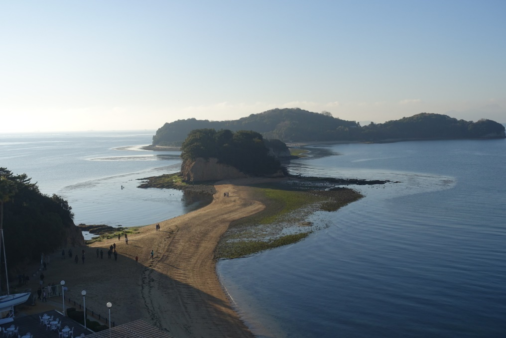

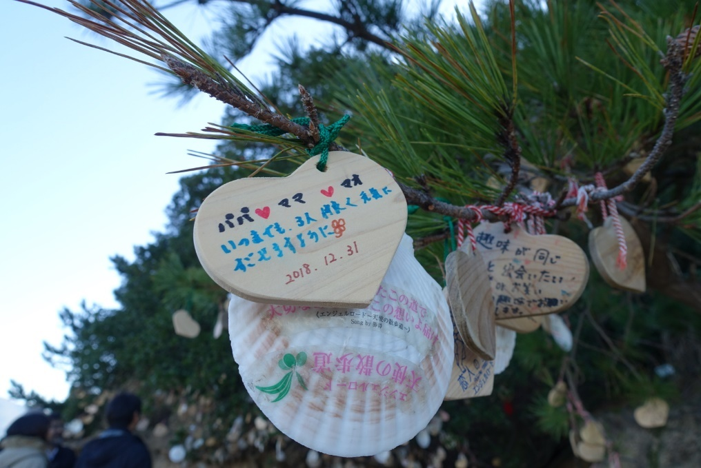

[圖片說明]：小豆島的天使之路。據說跟情侶一同走過會永遠在一起。

※

在小豆島的高中校園裡，棒球場成了學生們奮鬥的場所。夏日暑假期間，棒球隊的成員們正投入夏季特訓，每個人都懷著熱忱和決心，希望在接下來的比賽中彌補去年的遺憾。

棒球隊的成員們正在進行夏季特訓，希望在接下來的比賽中彌補去年的遺憾。投手龜梨和也、捕手今井翼、內外野手們齊心協力，每一個動作都透露出他們對勝利的渴望。

投手龜梨和也專注地控制著球速和路線，捕手今井翼則堅守位置，積極指揮場上動作。內外野手們，包括山田涼介、中山優馬、北山宏光和河合鬱人，都展現出了默契的配合。丸山隆平、村上信五和安田章大在外野敏捷移動，靈活捕接飛球。

一旁的替補球員二宮表現得尤其認真。作為一年級生，在訓練過程中，他全神貫注於每一個練習動作，眼中閃耀著想要成為正式球員、參加比賽的渴望。

同為替補球員的相葉，他跟二宮是鄰居。從小一起長大，雖然他對棒球的興趣不高，但從小就被二宮拉著一起打棒球，在社團中表現也不錯。

就在棒球隊訓練漸入佳境時，天空變得陰沉，一場突如其來的暴雨迫使他們中止了訓練，只能遺憾地解散。

由於還早，幾位同齡的隊員，也是相葉的同班同學，並未匆匆踏上歸途，而是齊聚於相葉家中。那裡，開著一家溫馨的餐廳，由相葉的母親美代子主理，她以熱情的款待和美味佳餚聞名，大家都很喜歡她。

朋友們攀上樓至相葉的房間，尋找各自的娛樂消遣。風間沉浸於漫畫世界，相葉與橫山則沉醉於電子遊戲的樂趣中。

二宮也想玩遊戲，但遊戲機僅限於雙人，只得在一旁耐心等候。

「你上學期的成績不太理想，應該趁暑假努力一下。」二宮好心地提醒。

「喂，暑假才開始，我還想放鬆一下呢。集訓那麼辛苦。今天好不容易能休息一下，你還要囉嗦。」相葉說。

「等到暑假結束，你就會後悔沒早點開始了。」二宮說。

他們的對話被樓梯口的美代子打斷，她喚著：「雅紀，下來幫忙！」

在相葉家的餐館，每日為了確保菜餚的新鮮和開店所需的各種物品，母子倆時常需要前往港邊。在那波光粼粼的碼頭上，精心挑選最佳的食材，並搬運必要的用品。

「媽，今天是好不容易可以休息，能不能讓我放鬆一會？」相葉說。

「有空的話更應該幫忙家裡，你不想吃飯了嗎？別再磨蹭了，快點！」美代子斬釘截鐵地回答。

「我還有許多事要做，那個…我和二宮約好要一起寫暑假作業。」相葉試圖找藉口。

「你剛才不是在玩遊戲嗎？」美代子不接受這理由。

「沒關係，你去吧，我們在這等你。」二宮見狀立刻接話。

而朋友們因為平常接受了美代子的照顧，在這關鍵時刻也紛紛倒戈，催促他去幫忙。相葉無奈離開，留下朋友們在房間裡聊天，二宮也乘機接過了遊戲手柄。

窗外的雨終於歇止，但對相葉而言，今日的休憩已成泡影。

[圖片說明]：竹馬一起打電動。

※

午後的港口迎來了煥然一新的景象，清朗的晴空將上午的陰沉洗刷乾淨，短暫的變幻宣告著山海交織的不定。

相葉站在輪渡的停泊處，陪著他的母親等待兩位尚未相識的客人。平日裡他會協助選購貨物和扛運重物，但今天的使命不止於此；美代子有些興奮地告訴他，將會有一位「新朋友」轉學進入他就讀的高中，那位名為大野智的男孩，是她多年好友之子。

陽光從厚厚的雲層中射下金色的光芒，映照波光粼粼的海面上，白海鷗在碼頭上空盤旋，發出輕柔的鳴叫聲，回響著渡輪的汽笛。

當渡輪停靠，美代子墊起腳尖，焦急地掃視著從船上下來的人群，而相葉則顯得有些不耐煩，雙手插在口袋裡，隨意地踢著碼頭邊的小石子。他對即將到來的新朋友感到好奇。

這時，一個男孩從渡輪上緩緩走下，他的身影如同磁鐵般吸引了相葉的注意。陽光透過厚實的雲層灑下，將金色的輝煌投射在他身上，使他在眾人中顯得格外耀眼。他那獨特的肌膚色調、帶有城市人特有的優雅與沉靜，加上他俊秀的面容和嚴肅的神情，自帶一股難以親近卻又深深吸引人的的氛圍。

此刻，美代子揚起手臂舞動，一位女士回應了她的問候，並與那男孩一起走向他們。

「這位是佳子阿姨，我們是多年的好友，她身旁的，就是她的兒子大野智。他即將和你一樣，在高中就讀，希望你們能相處融洽，成為好友。」美代子輕拍相葉的肩膀，打斷了他的凝視，喚回他的注意。

「我家的小智，今後麻煩你多多照顧了。」佳子阿姨說。

「絕對沒問題！我會好好照看他的。」相葉大聲答應，暗自歡喜能與這這麼好看的人做朋友。

隨即，相葉對著大野綻放了一個熱情的微笑。

「嘿，我叫相葉雅紀。很高興認識你，希望我們能成為好朋友。」相葉伸出友誼之手。

「你好，我是大野智。」大野的目光雙眼轉向相葉，點了點頭，面無表情，並未接受那伸出的手。

儘管感受到了大野智的冷淡和疏遠，相葉卻不以為意，反而對這位有著神秘氣息的新朋友更感到好奇。而他還未曾意識到，自己的世界將從這一刻悄然改變。

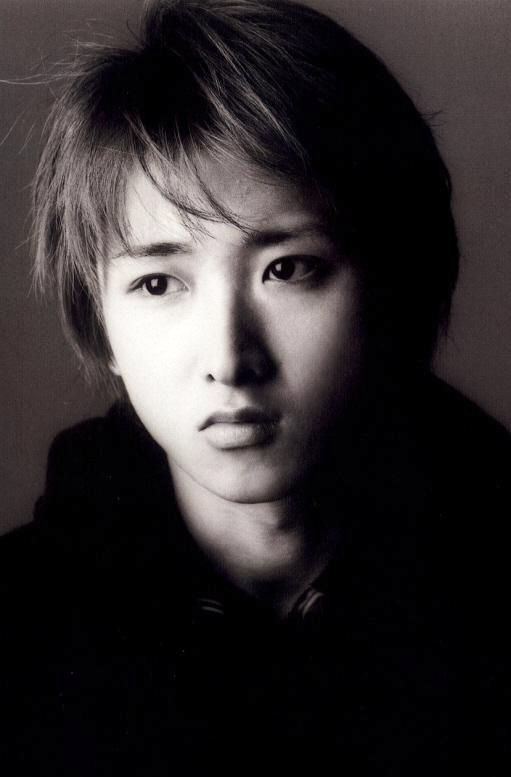

[圖片說明]：大野年輕時桀傲不遜的表情。

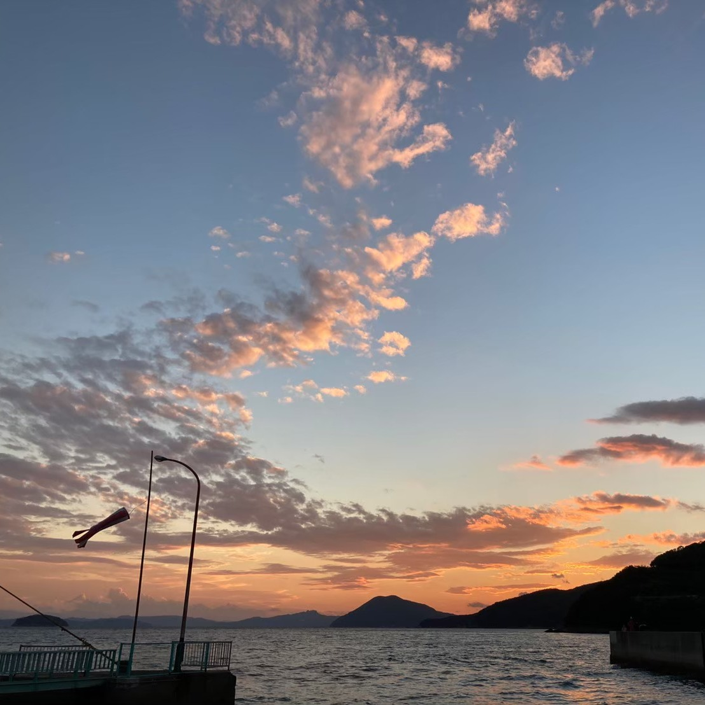

[圖片說明]：小豆島港口。

※

為了幫助大野融入新環境，相葉帶他來參加棒球社的暑期集訓活動。

「這個人是誰？」二宮向相葉詢問。

「這位是大野智，將會在新的學期轉入我們高中。我先帶他來棒球社體驗一下。」相葉笑答：「社團不是缺人嗎？一個人多總是好的，我們一起來玩吧！」

但到了場上，大野對棒球似乎提不起興趣，這態度引起隊友不滿。

一名隊員不滿地說：「新來的，能不能認真點？」大野漫不經心地回應了一句。隊員們交換了不滿的眼神。

這種矛盾使得球場氛圍微妙，團隊的互動也受影響。

之後在8月有夏季全國高校野球選手権大會，參賽的高中棒球隊需在地區預選中脫穎而出，而香川縣的地區預賽在7月舉行。

雖然他們因實力不足未曾代表香川縣參加全國賽，但在9月舉辦地區性賽事——「秋季四國地區高等學校野球香川縣大會」，他們還是有機會獲得取得不錯的成績。全隊都在為即將到來的秋季大會做準備，所以暑假的訓練格外重要。像這種地區性賽事，雖不直接決定全國賽資格，但對球隊的實力和聲譽有重大影響。

二宮對相葉在這關鍵時刻帶來一個不相干的人感到不滿：大野的不合群，會損害了球隊的凝聚力。

於是當著大野的面，二宮對相葉說：「你以後別再帶這人來棒球場了。」

「抱歉，是我錯了，大野對棒球沒興趣我還勉強他。」相葉說，「我會帶他去做別的他有興趣的事。」

「但我們暑假還有訓練，如果他不一起參加棒球社，你哪有時間陪他？」二宮說。

「我本來對棒球野沒那麼有興趣，反正我是候補球員。來不來參加都沒關係。」相葉有些賭氣地說。

二宮非常生氣，沒想到相葉為了照顧大野，說要減少訓練時間。 

「你這樣會被踢出社團的！」二宮大聲說。 

「或許是社團不夠包容新人吧。」相葉說完，拉著大野離開。

※

為了幫助大野更好地融入當地，相葉帶對方參觀了小豆島上的各種著名景點。夏天的小豆島風光迷人，其中最受歡迎的是寒霞溪，一條蜿蜒於山谷間的美麗溪流，兩岸綠樹成蔭，風景如畫。他們還去了天使之路，一條隨著潮汐變化而出現的沙洲，被譽為戀人們的聖地。接著，他們參觀了橄欖公園，那裡的橄欖樹在陽光下閃耀著翠綠的光芒。

相葉邀請二宮一起加入，但二宮卻顯得有些不情願。

「我們是本地人，去那些地方做什麼？人擠人熱死了。再說我們已經去過無數次了。」他抱怨道，「我們還是去打棒球吧！」

「但大野是第一次來，對他來說這一切都是新鮮的。」相葉說，「我想給他一個好印象。」

「這傢夥可沒給我一個好印象。」二宮嘟囔。

二宮雖然不情願，但他仍然想跟相葉一起遊玩，所以在棒球訓練之餘，他也加入了相葉和大野的小旅行。雖然他對大野的冷漠態度有所不滿，但能和相葉共度暑假時光，還是覺得高興。

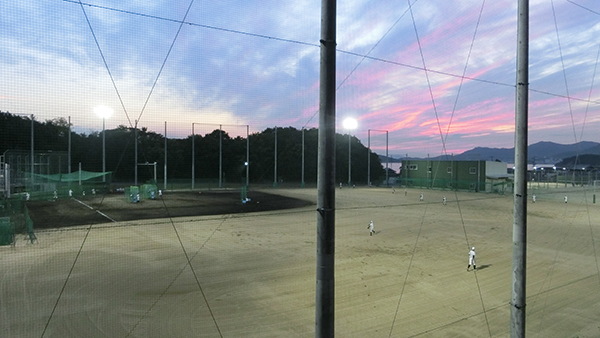

[圖片說明]：小豆島高校的棒球場。

※

在一個晴朗的下午，相葉帶著大野和二宮來到了海邊的垂釣地，這裡是當地人熱愛的釣魚去處。海風微涼，浪花輕拍岸邊的岩石，海面上偶爾有漁船緩緩駛過，營造出一種寧靜而愜意的氛圍。

「今天我一定能釣到最多的魚！」二宮自信滿滿地發言。

然而，隨著時間的推移，大野展現出了驚人的釣魚技巧，頻頻有收穫，而二宮卻幾乎一無所獲。

「你真的很擅長釣魚，大野。」相葉對大野表示讚賞。

「這沒什麼，我可能比較有經驗。」大野說。

「你一個城市小孩怎麼這麼會釣魚？」二宮說。

「我以前常跟爸爸去海釣。」大野說。

「你爸爸很愛釣魚嗎？」二宮追問。

「是的，我們有艘遊艇，週末時常出海。」大野說。

「你是在炫耀嗎？真是的！」

二宮聽到這話，心情變得更加差。

相葉察覺到二宮的情緒，趕緊安撫道：「別這樣，二宮。釣魚嘛，最重要的是享受過程，不是嗎？釣魚也要靠運氣的。」

二宮默默地整理起他的釣具，內心泛起一絲落寞。他努力的釣魚成果並未如期，而相葉的目光卻牢牢吸附在大野的身上。那份專注，令二宮心中五味雜陳，他雖然對大野那絕佳的釣魚技巧抱以欽佩，卻也不免對相葉如此顯著的關注感到一絲嫉妒。

※

暑假的尾聲漸漸逼近，相葉如往常般來到了二宮家的門前，帶著未完的作業，期望兩人可以一起埋首於暑期作業的最後衝刺。雖然口口聲聲說是「一起寫」，其實二宮早已將自己的份量完成得一干二淨，而相葉則希望能夠通過「參考」對方的作業，來加快自己的進程。

二宮的房間裡，牆壁上貼滿了各種棒球明星的海報，書桌上堆滿了學習資料和各式筆記。房間的一角擺放著二宮的棒球裝備，透露出他對棒球的熱情。窗戶旁擺著一盆盛開的植物，帶來一抹生機。

書櫃裡擺滿了二宮喜歡的漫畫書和一些棒球相關的紀念品，牆上掛著他和相葉在不同場合拍的照片，見證了他們多年的友誼。書桌上堆滿了作業本和筆記，顯示著暑假尾聲的忙碌。

終於可以和相葉單獨相處了，二宮懷著一些期待。

最近，常有一個影子插足在他們之間，那是大野——新來的轉學生，由於暫未被分配暑假作業的關係，所以今天只有相葉一個人出現。

但二宮發現，相葉的人在這裡，心思卻似乎仍然停留在大野身上。當他翻看相葉的日記作業時，發現裡面記載了許多關於大野的事情，這讓他感到嫉妒。

「你為什麼這麼關注他？」二宮質問，「滿滿寫的都是大野，簡直像跟蹤狂。」

「我才不是跟蹤狂，是媽媽叫我照顧他，我只是做我該做的。」相葉慌亂地辯解。

原本二宮理所當然地認為，這個暑假會延續過往的傳統：與相葉在炎烈的陽光下球場上一汗方休，享受遊戲機上的激戰較量，互相交換著他們最新一期的漫畫，或是肩並肩靜候垂釣的成果。

這些過去的點點滴滴，建築起他們之間無可取代的深厚情誼。

然而，大野的出現打破了這一切，使得那些互相陪伴的時光變得支離破碎。

[圖片說明]：

棒球少年 non-no 2010年 11月 二宮和也 三浦春馬 チャンミン トートなし

※

開學第一天早上，相葉發現自己遺漏了幾道數學習題，急忙向二宮求助。

「喂，和也，借我抄一下！」相葉希望能在老師抵達前迅速抄下數學習題。

「算了吧，你自己想辦法。」二宮擺出一副不樂意的樣子，他還記著前幾天的不愉快，假裝作不肯借，想讓相葉感受到自己的重要性。

在二宮和相葉互相開玩笑，爭搶著作業本的打鬧中，教室的門忽然開啟，老師帶著一名新面孔走了進來。

老師向全班介紹說，大野是一位從東京而來的轉學生，並且請他進行自我介紹。

「大家好，我是大野智，請多多指教。」大野的話簡短，但他的聲音清晰，隨後，他就沉默了。

他那不多言的舉止，使得教室短暫的空氣凝固了下來，降臨了一片出乎意料的安靜。為了打破這突如其來的靜默，相葉便迅速熱情地開口。

「大野同學是很聰明，而且釣魚技術也超一流，暑假的時候他還幫了我很多忙。」相葉興奮地補充道。

「你們認識？」老師略顯驚訝地詢問。

「是的，我們暑假一起玩耍。」相葉回答，看起來相當得意。

「那麼，就讓大野同學坐在相葉旁邊，這樣你可以幫助他更好地融入學校生活。」老師宣佈後說道：「二宮同學，麻煩你把座位換到門口那邊，謝謝你。」

這個安排明顯是希望讓新生能快速適應新環境，但對一直坐在那個位置的二宮來說，無疑是個不小的變化。看著相葉興奮的樣子，二宮心裡雖然感到一股不快，但他還是咬牙壓抑住自己的情緒，默默地將自己的東西搬到了新的座位。

一到下課，大野立刻成為了女孩們熱切關注的中心。她們簇擁在他周圍，對他那來自東京的背景展開了無窮的好奇和詢問。雖然大野依然保持著其一貫的冷漠，相葉卻忍不住熱情地替他解答這些問題。

這樣的場面讓二宮甚是無奈，不禁暗自嘀咕：「這個傻瓜。」

※

放學的鐘聲響起，二宮在教室門口站定，等待著與相葉一同踏上回家的路。然而，相葉似乎對周遭毫無覺察，依然與坐在旁邊的大野交談不斷。這種情況令二宮感到不耐煩，他踱步來到兩人身邊，卻發現他們正鑽研著數學問題。

相葉在大野的幫助下解開了自己的疑惑，對此感到無比欣慰和開心。

「哇！大野真的很厲害。」相葉讚歎著。

這話聽在二宮耳中，更加刺激了他。在他眼裡，大野僅對作業稍作指點，相葉就這麼感激，可明明作業大部分都是抄自己的，為何不也來誇獎自己呢？

「這種簡單的題目都不會，才會覺得厲害啊？」二宮帶著些許譏諷插嘴。

「哎呀，我就是比較笨嘛，數學太難了！」相葉轉向二宮，「你知道嗎？大野講起來真的很容易理解，他一講我就懂了。」

「不過我覺得他總是一副想睡的樣子，上課也不聽老師講課，只會看著窗外發呆。」二宮說。

「可是老師叫他起來回答問題，他都答得出來呢。」

「他大概是覺得鄉下教的課太簡單，不屑聽吧。」

「他一定是在沈思，在想更深入的問題。」

「我們能不能不談大野了？我們一起回家吧。」

「不行，我今天得送大野回家。他對這裡還不熟，需要我陪著。」

「怎麼就拋下我了？」二宮瞪大了眼睛。

「真不好意思，但是初來乍到，他還需要我幫忙指路。」

「明明我家就在你家旁邊，為什麼不能跟我一起走？」二宮忿忿不平地質問道。不僅在學校連座位都被搶，連一同回家的路途都被攔截。

「等大野熟悉環境後，我們再一起回家，好嗎？」

相葉說完，就拉著大野走出教室。

「你整個暑假都帶他在島上跑來跑去的，他還會不熟悉路況？」二宮獨自一人站在教室門口，有些氣憤地哼了一聲。

教室內還有一些同學仍未離開，二宮找到了棒球社的隊友——橫山和風間，開始吐槽起相葉對大野的過度保護。當他們想起大野在暑假棒球賽中的表現時，不禁也開始表達出自己的不滿。他們的聲音吸引了其它男同學的注意，這些男同學同樣因為大野在女生中的廣受歡迎以及他那冷漠的態度而感到一絲嫉妒。

於是，這群學生決定要對大野進行一些「教育」，讓他明白在這座小島上，他不能夠肆無忌憚地忽略一切。

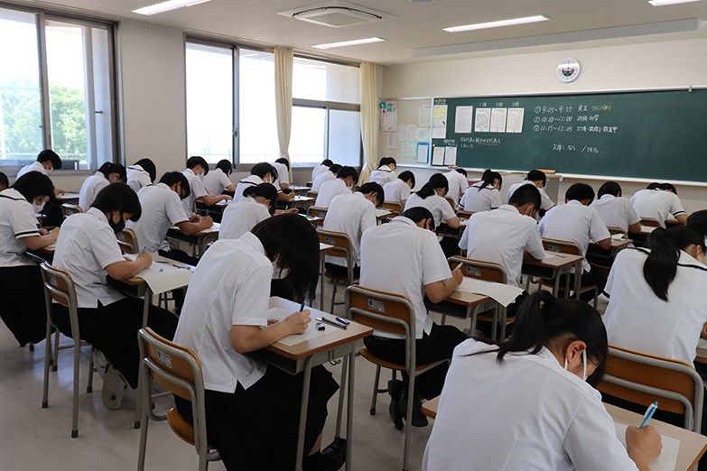

[圖片說明]：高中教室

※

對大野而言，父母的離異帶來了深刻的陰影，令他無法在心靈上打開，與人建立聯繫。他渴望的，只是返回那個充滿回憶的東京，回到那個安慰自己的舊世界中。

抱著這樣的心境，他不自覺地戴上了一副無形的面具。這副無形的面具，既是防線，也是牢籠，將大野囚禁在一個看似平靜實則幽暗的房間中，只有自己能觸碰到自己內心中最真實又脆弱的部分。他渴望融入，卻更害怕世界對他內心世界的窺視，害怕那些關心與善意的目光最終會撕裂他勉強維持的鎧甲。

但這種內心的孤立，卻在無意中散發出了一絲與周遭環境脫節的氣息，被同學們誤解為一種蔑視。在他們眼中，大野不過是個瞧不起這片土地與人們的都市來客。於是，校園裡的玩笑逐漸升級為對他的刻意排擠，這種隱晦的敵意如陰影般籠罩著大野，卻未能觸及到他心底最真實的孤獨。

學校生活中，多次場合下的小動作、悄聲譏笑以及蓄意的無視，通通在面對大野時演變成一種刻意的群體霸淩。面對這一切，大野沉默始終如一，他只能用更加淡漠的態度來保護自己。

這些暗中的欺淩如同冷冽的寒風，不斷刺穿大野那薄弱的盾牌，嘲諷著他與眾不同的行徑。每一次故意排擠，每一聲未被察覺的冷嘲，都讓他的心進一步沈入孤單的深淵。

大野的心靈似乎在每一段低語與每一次漠視中更加僵硬，他的冷漠成了最堅硬的護甲，將自己封鎖於一個人際關係無法侵入的堅固堡壘中。他將自己的感受深藏，以避免那些傷口被新的嘲諷觸碰，以避免內心的疼痛被放大於眾人面前。

起初，相葉並未意識到這種情況，他以認為大家都和他一樣，樂於接納一個新同學。

直到一次意外發生，他才察覺到情況不對。

※

在那朵濃雲壓頂的午後，全班同學正於體育館內投身運動時，幾位同學不由分說地指派大野去搬運體育器材。當他們穿越陰暗的樓梯，來到地下室的儲物間前，大野使先邁入了這個房間，背後馬上傳來閂鎖之聲。他本能地回頭一望，門已關閉，獨留他一人陷入困境。

四周為混凝土的牆壁，頂上一簇昏黃的燈光，空氣中瀰漫灰塵與黴味。大野試圖用儲物室裡的老舊籃球、鈍重的啞鈴，甚至是軟弱的跳繩來撞擊那扇堅固的門，但是沒有用，無力感壟罩著他，癱坐在冰冷的地板上，只有天花板上隱約透入微弱聲響。

隔節課程開始時，相葉隨即察覺到大野那異常的缺席。起初以為或許大野因不適前往保健室，他前往尋找，卻未見人影。相葉心急如焚，穿行於校園的每一處角落，尋覓著對方的蹤跡。巧合的是，在學生私語與隱隱哄笑中，他聽到大野正被遺忘於地下室的深處。

他急忙奔向體育館，衝到地下室的儲物間，面對那扇被木板卡住的門，他幾乎不敢相信這是同學們的惡作劇。他全身力量集中於肩膀，一次次撞擊，直至木板終於松動，門隙被擠開一條縫隙。

「大野！」相葉的呼喚中帶著驚慌，他搬開阻隔的木板，推開沉重的門。

當門緩緩開啟，見到大野靜默垂坐於角落，他的手臂交叉於胸前，彷彿在尋求一絲自我保護。從他的手指尖端傳出的是輕微而不安的顫抖。

相葉的心狠狠一縮，他對於同儕的惡劣行徑以及自己的疏忽大意滿是懊悔與自責。他加快腳步，來到大野的身旁輕輕蹲下身子，嘗試與他的視線對視。

「對不起，我來晚了。你沒事吧？」相葉伸出手，想扶起大野。

「都是因為你總是繞著我轉，我才會成為霸淩的目標。」大野突然起身，含怒目視相葉。

「我沒有想讓你受欺負，我只是想讓你不那麼孤單。」相葉感到錯愕但仍試圖解釋。

「你以為你在幫我？其實只是讓我更尷尬。你那些所謂的朋友會討厭我，因為在他們眼中，我搶走了你。」

「那是他們誤會了，不是你的錯。」

「所以你覺得，我遭受到欺淩，你輕描淡寫一句『誤會』便足以為他們開脫？」大野的保護屏障在壓力下碎裂，情緒宣洩如同洩洪的洪水，夾帶著種種辛酸和不甘。

「對不起，我說錯話了，我只是想關心你。」

「正是你這份關懷，將我推到了所有人的對立面。」

「我只是不願見你孤單一人。」相葉的淚水在眼眶中打著轉，他的關心不慎成為了大野的負累。

「夠了，我不需要你的同情或陪伴，即便獨自面對一切，我也能夠生活下去。」

大野大步從相葉身旁走過，離開了儲物間。

相葉想要叫停大野，想繼續解釋，但他並未張嘴，因為他深知，此時此刻，無論他說何種話語，只會讓對方更加生氣。他的內心中充滿了無力和自責。

曾經，相葉以為自己能成為大野寂寞天空中的溫暖陽光，卻沒想到終究可能變成了帶來陰霾的風。

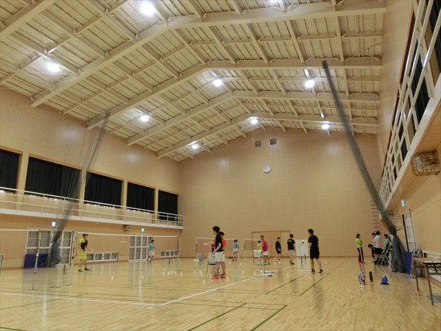

[圖片說明]：體育館。