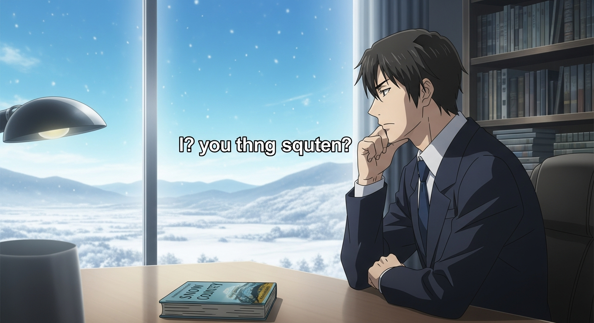
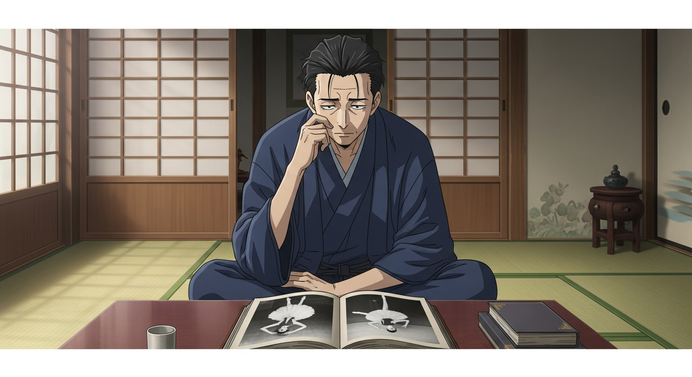
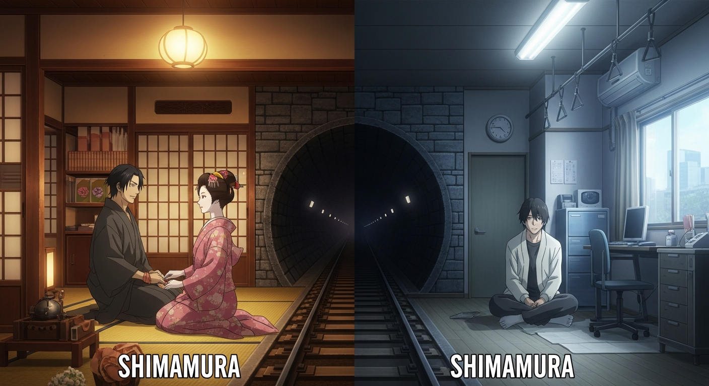
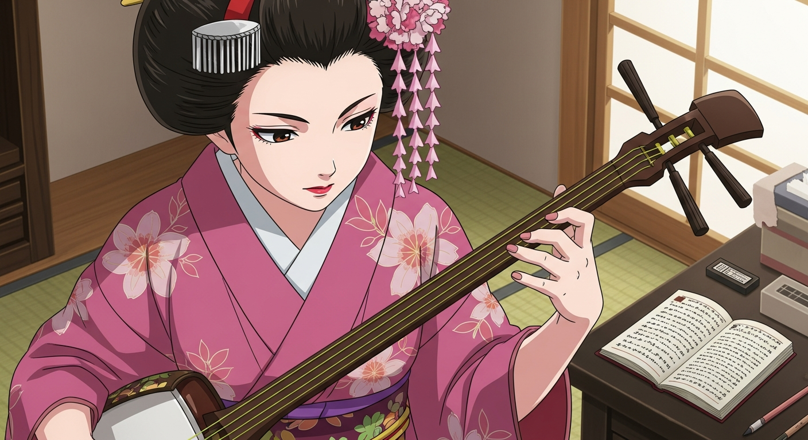
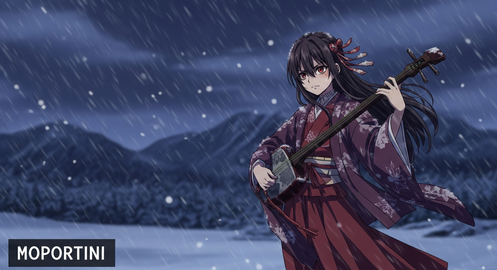
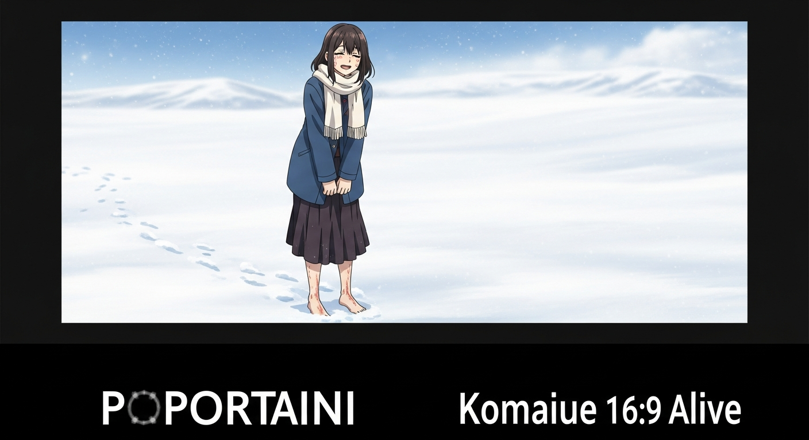

> 「穿過縣界長長的隧道，便是雪國。夜空下一片白茫茫。」

## 🎬 雪國的扎心提問

很多人可能都在課本上讀過這句話，它來自川端康成的《雪國》，是日本文學史上的一座金字塔，把那種淒美又虛無的愛情，寫到了極致。

不過，我今天不想跟你聊文學，我想聊一個更扎心的問題：**你以為的深情，會不會其實只是最精緻的自私呢？**

在一段感情裡，一個人全心投入，就算明知沒有結果也像飛蛾撲火；另一個人卻始終保持距離，把一切都當作人生體驗。

你覺得，這兩種人，到底誰更可悲？或者說，誰才是一直在欺騙自己呢？

---

## 🎭 男主角島村的怪癖

很多人以為，川端康成的《雪國》，是在講一個有錢男人和藝伎的愛情故事。但如果你只看到愛情，那可能就小看了川端康成。

這本書真正想探討的，其實是**人類慾望最底層的樣貌**，以及我們該如何面對生命中的那種「空」。他透過三個角色，呈現了三種面對虛無的態度。

### 島村這個人，很有意思

他是一個靠著祖產過活的東京有錢人，平常沒事就研究西方芭蕾。但奇怪的是，**他從來沒親眼看過任何一場芭蕾舞表演**。他所有的知識，都只是來自書本和照片，是一種純粹的空想。

你想想，一個人這麼熱愛舞蹈，卻又刻意避開真實的舞蹈，這不是很矛盾嗎？

---

## 💔 最精緻的自私

主角島村的行為，其實不是因為懶，也不是沒條件。他有的是錢和時間。這是一種深思熟慮後的**「主動選擇」**。

他刻意躲開所有直接、真實、會讓他動情的體驗，只願意隔著一段安全的距離去欣賞「美」。

為什麼要這樣？

**因為一旦你親眼看見舞者額頭的汗、顫抖的肌肉，那種美，就不再安全了。** 它會逼你產生真實的情感，要求你投入、要你負責。而島村，恰恰什麼都不想負責。

懂了這一點，你再看他和駒子的關係，就全都說得通了。他一次又一次來到雪國，沉醉在駒子的美與愛之中，但每一次，他都選擇轉身離開。

> 在他的世界裡，雪國就像一個不需要負責任的夢境。他在這裡體驗美、消費美，然後穿過隧道，毫髮無傷地回到現實。

想想看，我們在不同關係、不同城市，甚至不同社交帳號之間切換，是不是也以為，只要把生活切得夠零碎，就永遠不必面對一個完整的自己，和一段完整的關係了？

---

## 🔥 駒子的徒勞與倔強

小說裡有個很經典的細節。島村凝視著自己那根摸過駒子的手指。他不是在想念駒子這個人…而是在回味指尖上殘留的觸感。

**他把一個活生生的女人，簡化成了一段記憶。**

這根手指，其實就是島村這個人的縮影。他只用指尖輕輕觸碰世界，然後就縮回來，只要餘韻，不要全部。

他以為自己超脫，其實是懦弱。因為真愛，是需要接受一個人的全部，包含她的痛苦和期待。島村只想要美的碎片，不想要美的代價。

**你說這是深情嗎？不，這是一種最精緻的自私。**

### 然後我們來看駒子

她是雪國小鎮的藝伎，不只年輕漂亮，還非常有才華。她每天苦練三弦琴，練到手指都長滿了硬繭；還堅持讀書、寫筆記。

在那個時代的偏遠小鎮上，一個藝伎能活得這麼認真、這麼有追求，真的讓人非常心疼，也由衷佩服。

---

## 🌸 徒勞即是壯舉

在《雪國》這本小說裡，有一個詞非常關鍵，那就是**「徒勞」**。

故事裡的女主角駒子，在一個偏遠的小鎮努力讀書、練琴，但在男主角島村眼裡，這一切都像是沒有觀眾的表演，一種美麗又讓人心痛的浪費。

但最厲害的是，**駒子自己其實什麼都懂**。她知道這段感情沒有未來，也知道自己被困在這個小地方。但她選擇了什麼？

**她選擇了，就算知道是徒勞，也要全力以赴地去愛、去生活。**

這不是傻，而是一種看清現實後，依然選擇燃燒的「清醒的倔強」。

> 這就像卡繆筆下的西西弗斯，明明知道石頭推上山頂後還是會滾下來，卻一次又一次地把它推上去。

為什麼？因為當你明知命運荒謬，卻依然選擇行動，這個「選擇」本身，就成了意義。

所以，駒子的徒勞不是悲劇，而是一場壯舉。她用注定無果的行動，對抗了生命的虛無。

**在島村和駒子之間，你覺得，究竟是誰，才算真正活過呢？**

---

## 👻 玻璃後的幻影 - 葉子

接下來，我們來聊聊小說裡最關鍵的人物，葉子。

她出場不多，卻是理解主角島村的最後一把鑰匙。島村第一次看見她，是在火車的車窗上。注意喔，他看到的不是葉子本人，而是她映在玻璃上的倒影，跟窗外的雪景疊在一起。

從一開始，葉子對島村來說就不是一個真實的人，而是一個關於「美」的幻影。

- 如果說，駒子是那種可以觸碰、但注定會失去的美
- 那葉子，就是連一開始都無法觸碰的，純粹的美

### 結尾的銀河

小說結尾那場大火，把島村這個人的靈魂，完全暴露了出來。葉子從樓上墜落，駒子發了瘋似地衝過去抱住她。

**那島村呢？**

他竟然覺得，葉子墜落的姿態有種超現實的美感，接著，他抬頭看見了滿天銀河。

一個人可能剛死在眼前，他感受到的卻是美。這就是島村，一個徹底失去直接感受能力的人。所有喜怒哀樂，都必須先經過「審美」這個濾鏡。

**駒子奮不顧身的反應是愛，是本能；而島村站在原地的審美，是一種精神上的殘疾。**

---

## ❄️ 雪地裡的人才活過

在一段關係裡，你當過島村，還是駒子？

**當島村：** 你享受被愛，卻始終留著一條退路，把無法投入的恐懼，包裝成所謂的成熟與理性。

**當駒子：** 你用盡全力去愛，明知可能徒勞無功。因為你覺得，如果保護自己的代價，是變得麻木，那代價實在太高了。

---

這就像川端康成筆下的《雪國》：

- 你可以像島村，**隔著車窗玻璃欣賞雪景**，安全，卻隔絕
- 或者像駒子，**赤腳走進雪地裡**。會痛，會冷，但那份刺骨的真實，卻是活著的證明

我們這個時代，有太多誘惑讓我們躲在玻璃後面，安全地旁觀一切。但一個從不把手伸進火裡的人，雖然不會被燙傷，卻也永遠不會知道，溫暖是什麼感覺。

> **不要用「看透了」，來替代「活過了」。**

川端康成把他最好的文字給了駒子，我想，他是對的。

---

*文章改編自影片腳本，原作者：王立傑*
